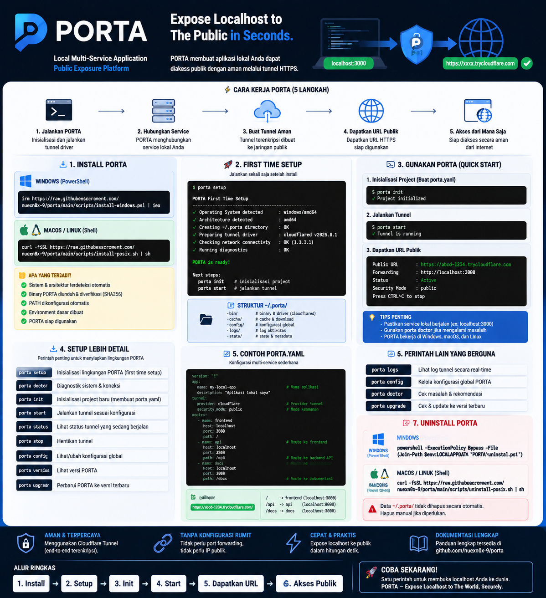
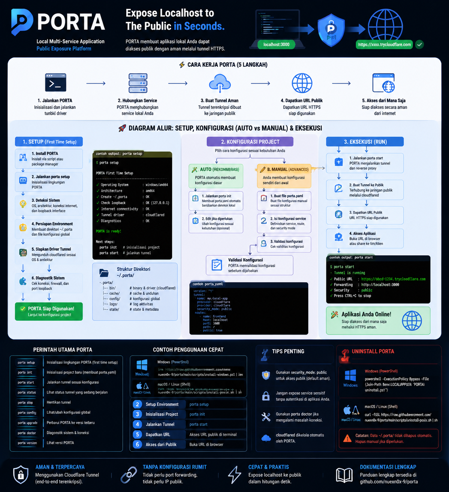

# PORTA

> **Expose your local multi-service application to the world with one command.**

[](https://go.dev)
[](LICENSE)
[](docs/RELEASE_NOTES_v1.0.0.md)

---

## What is PORTA?

**PORTA** is a standalone, client-side developer tool that binds multiple local applications running on `localhost` (e.g. Frontend on `:3000`, Backend API on `:8000`, and WebSocket server on `:9001`) into a single consolidated reverse proxy gateway and exposes them to the public internet via a secure, encrypted HTTPS tunnel.

```text
Developer Machine                      Public HTTPS Environment

Frontend   (localhost:3000) ──┐
                              ├─► [ PORTA Gateway ] ──► [ Cloudflare Tunnel ] ──► https://demo-app.trycloudflare.com
Backend    (localhost:8000) ──┘         │
                                        ├─► Path: /    ──► Frontend (:3000)
                                        └─► Path: /api ──► Backend  (:8000)
```

---

## ✨ Features

- 🚀 **Zero-Friction Ingress:** One command exposes your app via Cloudflare Quick Tunnel — no account, API keys, or credit card required.
- 🔀 **Unified Ingress Routing:** Expose a single service (`:3000`) or multiple services (`:3000` + `:8000`) under **one public domain**.
- ⚡ **Full-Duplex WebSockets:** Transparent connection hijacking for hot-module reloading (Vite/Webpack), live chat, and Socket.io.
- 🌊 **Unbuffered Streaming:** Zero-delay buffer flushing for Server-Sent Events (SSE) and LLM streaming completions.
- 🛡️ **SSRF & Security Isolation:** Strict loopback validation protecting local workstations from private LAN pivoting and cloud metadata probing.
- 🔒 **Access Gatekeeper:** Protect public endpoints with HTTP Basic Auth (`401`) or Bearer/Query Tokens (`403`).
- 🧹 **Safe Logging:** Automatic redaction of sensitive credentials and tokens (`?porta_token=[REDACTED]`) in all logs.
- 📊 **Interactive Terminal UI:** Real-time ANSI status table with live request streaming and sub-500ms graceful shutdown.

---

## ⚡ Quick Start

### 1. Automated Installation (Single Command)

**Windows (PowerShell):**
```powershell
irm https://raw.githubusercontent.com/nuexn0x-9/porta/main/scripts/install-windows.ps1 | iex
```

**Linux & macOS (Shell):**
```bash
curl -fsSL https://raw.githubusercontent.com/nuexn0x-9/porta/main/scripts/install-posix.sh | sh
```

*(Alternatively, download pre-compiled standalone executables from [GitHub Releases](https://github.com/nuexn0x-9/porta/releases)).*

---

### 2. Configure Your Project

Make sure your local application server is already running (e.g. `npm run dev` or `python main.py`), then choose either **Auto-Detection** or **Manual Configuration**:

#### 🔹 Option A: Auto-Detection (Fastest)
In your project directory, let PORTA automatically scan listening localhost ports and generate `porta.yaml`:
```bash
porta init
# Or use --force to overwrite an existing config:
porta init --force
```

#### 🔹 Option B: Manual Configuration (`porta.yaml`)
Create or edit `porta.yaml` directly in your project root:

```yaml
version: "1"

project:
  name: my-app

services:
  # 1. Frontend Web App
  frontend:
    port: 3000
    route: /

  # 2. Backend REST API
  backend:
    port: 8000
    route: /api
    strip_path: false

# (Optional) Basic Auth Security
security:
  mode: password
  password: "admin:SecretDemo123"
```

Verify your configuration syntax:
```bash
porta config
```

---

### 3. Start Public Exposure

```bash
porta start
```

PORTA launches the reverse proxy gateway, establishes the secure HTTPS Cloudflare Tunnel, and displays the interactive live status TUI in your terminal! Share the public URL with your team, clients, or webhook providers.

---

---

## 💻 CLI Commands

| Command | Description |
| :--- | :--- |
| `porta init` | Scan local listening ports and generate `porta.yaml`. |
| `porta start` | Start the reverse proxy gateway and public tunnel in foreground. |
| `porta status` | Inspect configured services, routes, and JSON status. |
| `porta logs` | Tail and filter structured access logs. |
| `porta setup` | Initialize `~/.porta/` runtime environment and pre-cache drivers. |
| `porta upgrade` | Check for updates and self-upgrade binary in-place. |
| `porta version` | Print version and build metadata (`--json` supported). |
| `porta config` | Validate syntax and display parsed configuration. |
| `porta doctor` | Check loopback networking, internet connectivity, and drivers. |

---

## 🗑️ Uninstallation

To completely remove PORTA and its global configuration from your system:

**Windows (PowerShell):**
```powershell
irm https://raw.githubusercontent.com/nuexn0x-9/porta/main/scripts/uninstall-windows.ps1 | iex
```

**Linux & macOS (Shell):**
```bash
curl -fsSL https://raw.githubusercontent.com/nuexn0x-9/porta/main/scripts/uninstall-posix.sh | sh
```

---
<p align="center">
  
</p>

<p align="center">
Expose Your Localhost to The World, Securely.
</p>
---
<p align="center">
  
</p>

<p align="center">
Expose Your Localhost to The World, Securely.
---
<p align="center">
  
</p>

<p align="center">
Expose Your Localhost to The World, Securely.
---
## 📚 Documentation

- [User Guide & Tutorials](docs/USER_GUIDE.md)
- [Configuration Reference](docs/CONFIGURATION_REFERENCE.md)
- [Security Model & Threat Defenses](docs/SECURITY_MODEL.md)
- [System Architecture Specification](docs/SYSTEM_REQUIREMENTS_FINAL.md)
- [Product Requirements (PRD)](docs/PRODUCT_REQUIREMENTS_FINAL.md)
- [Troubleshooting Guide](docs/TROUBLESHOOTING.md)
- [Developer & Contributing Guide](docs/DEVELOPMENT.md)

---

## 🗺️ Roadmap

- [x] **v1.0.0 (MVP):** Foreground CLI, Cloudflare Quick Tunnel, LPM Router, WebSocket, SSRF Guard, TUI.
- [ ] **v1.1.0:** Detached background daemon mode (`--detach`), persistent custom domains, ngrok driver.
- [ ] **v1.2.0:** Integrated process orchestrator (`run: npm run dev`), multi-environment configs.
- [ ] **v2.0.0:** Web inspection dashboard, TCP/UDP tunneling, team collaboration cloud plane.

---

## 📄 License

Licensed under the [Apache License, Version 2.0](LICENSE).
