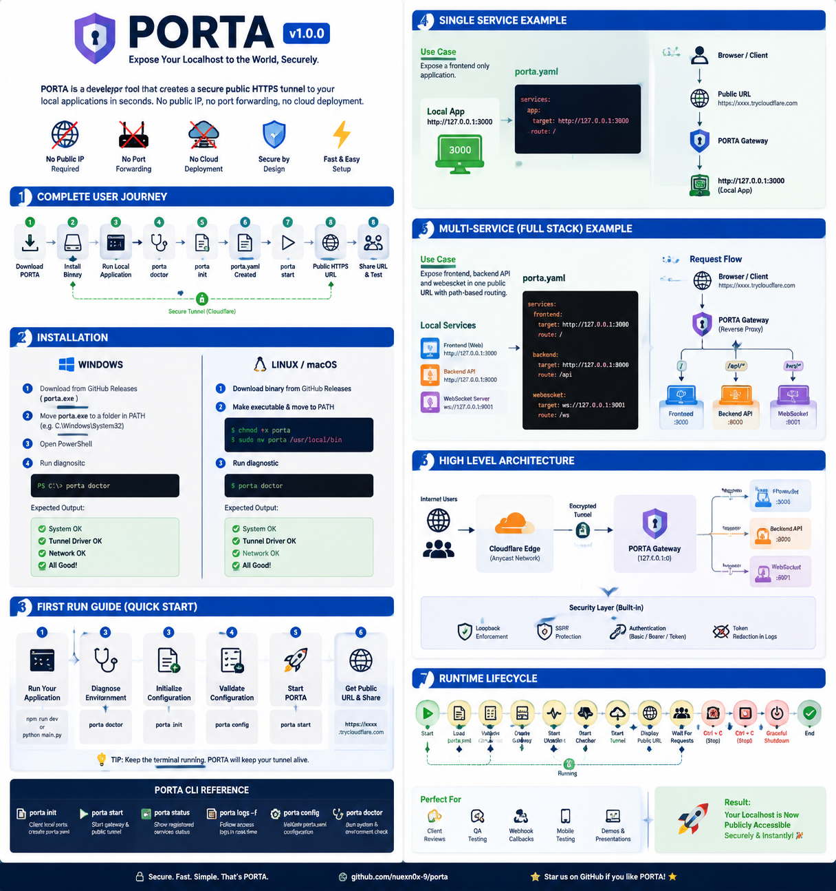
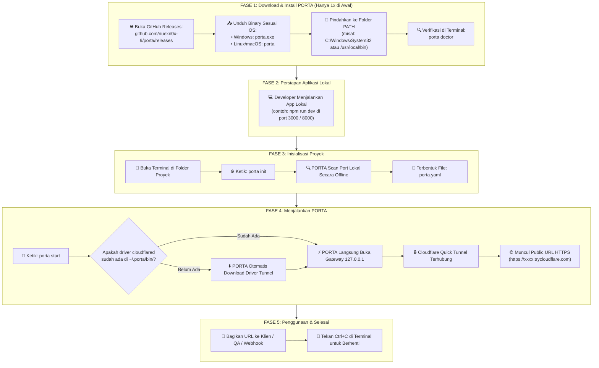
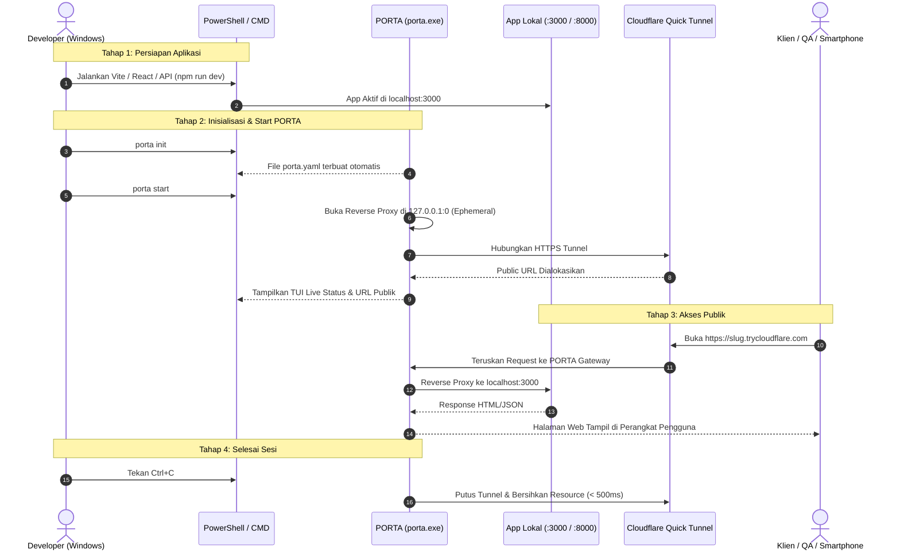
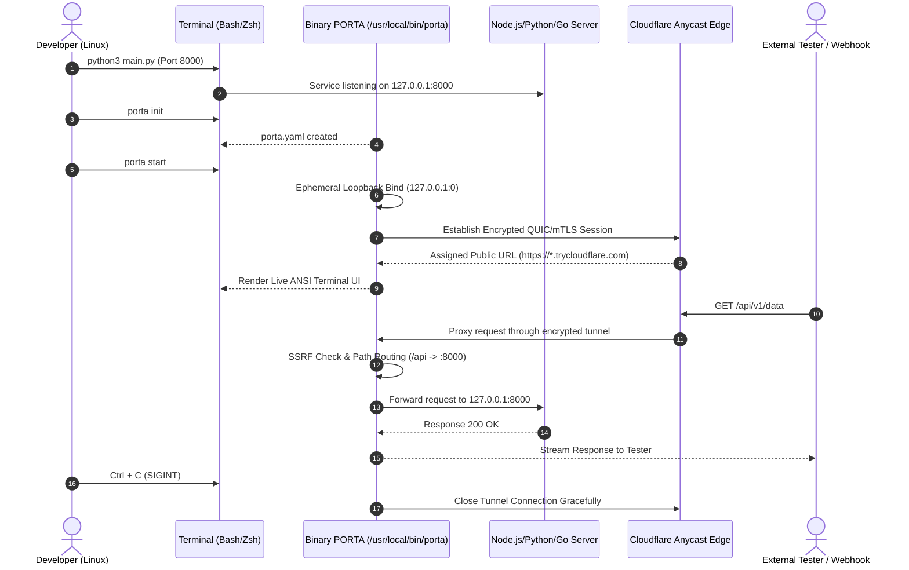
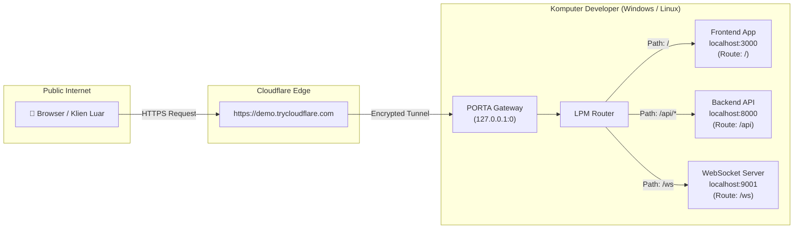
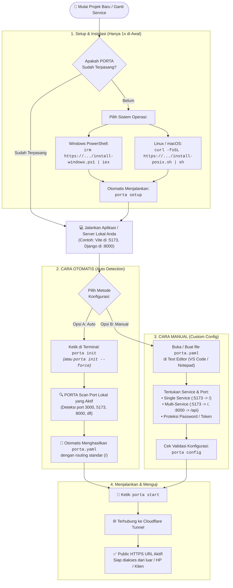

# DIAGRAM & PANDUAN LENGKAP PENGGUNAAN PORTA (DARI AWAL DOWNLOAD)

Dokumen ini menyediakan diagram visual lengkap mulai dari **mengunduh PORTA pertama kali**, inisialisasi proyek, hingga menjalankan terowongan publik di **Windows** dan **Linux**.



---

## 1. Diagram Alur Lengkap dari Awal (Download -> Run -> Share)



---

## 2. Diagram Penggunaan Pengguna WINDOWS

### 2.1 Alur Kerja Pengguna Windows (PowerShell / CMD)



### 2.2 Langkah Praktis di Windows:

```powershell
# 1. Pastikan aplikasi Anda sudah berjalan di localhost
npm run dev

# 2. Buka jendela PowerShell baru di folder proyek Anda
cd C:\Users\nama-user\my-project

# 3. Cek kesiapan sistem & driver tunnel
porta doctor

# 4. Inisialisasi konfigurasi otomatis
porta init

# 5. Jalankan PORTA (Akan muncul TUI interaktif dengan URL HTTPS publik)
porta start

# 6. Selesai: Tekan Ctrl + C untuk keluar
```

---

## 3. Diagram Penggunaan Pengguna LINUX

### 3.1 Alur Kerja Pengguna Linux (Bash / Zsh)



### 3.2 Langkah Praktis di Linux:

```bash
# 1. Jalankan aplikasi lokal Anda
python3 -m http.server 8000

# 2. Buka terminal di direktori proyek
cd ~/projects/my-app

# 3. Inisialisasi porta.yaml
porta init

# 4. Jalankan PORTA
porta start

# 5. Cek log secara terpisah jika diperlukan (di terminal lain):
porta logs -f

# 6. Hentikan dengan Ctrl + C
```

---

## 4. Diagram Arsitektur Routing Multi-Service

Diagram ini menunjukkan bagaimana PORTA membagi satu URL publik ke beberapa aplikasi lokal yang berbeda:



---

## 5. Diagram Setup & Konfigurasi: Cara Otomatis vs Cara Manual

Berikut adalah alur perbandingan lengkap antara **Konfigurasi Otomatis (Auto)** dan **Konfigurasi Manual**:



---

### Perbandingan Langkah Praktis:

#### A. Cara Otomatis (Auto)
Cocok untuk pemula atau saat berpindah ke projek baru:
```powershell
# 1. Masuk ke folder projek Anda
cd G:\projek-anda

# 2. Jalankan aplikasi lokal Anda terlebih dahulu
npm run dev

# 3. Jalankan inisialisasi otomatis
porta init

# 4. Langsung jalankan PORTA
porta start
```

#### B. Cara Manual (Custom Multi-Service & Password)
Cocok jika Anda memiliki arsitektur Frontend + Backend + WebSocket atau ingin menambahkan proteksi password:
```yaml
# Simpan sebagai: porta.yaml di root folder projek Anda
version: "1"

project:
  name: my-custom-app

services:
  # Service 1: Frontend (Next.js / Vite / React)
  frontend:
    port: 3000
    route: /

  # Service 2: Backend REST API
  backend:
    port: 8000
    route: /api
    strip_path: false

# Opsional: Keamanan Password
security:
  mode: password
  password: "admin:Demo12345"
```

Setelah file disimpan:
```powershell
# 1. Validasi sintaks file konfigurasi
porta config

# 2. Jalankan PORTA
porta start
```

---

## 6. Ringkasan Perintah CLI Lengkap

| Perintah | Fungsi Utama | Kapan Digunakan? |
| :--- | :--- | :--- |
| `porta setup` | Inisialisasi folder global `~/.porta/` & cek dependensi | Dipanggil otomatis saat instalasi |
| `porta doctor` | Cek koneksi internet, loopback bind, dan driver tunnel | Jika terjadi kendala koneksi |
| `porta init` | Scan port lokal secara otomatis dan buat `porta.yaml` | **Metode Otomatis** |
| `porta init --force` | Timpa konfigurasi `porta.yaml` lama dengan hasil scan baru | Saat ganti projek / port |
| `porta config` | Memvalidasi sintaks dan menampilkan struktur routing `porta.yaml` | **Metode Manual** sebelum start |
| `porta start` | Membuka gateway reverse proxy dan membuat URL publik | Saat ingin membagikan aplikasi ke internet |
| `porta status` | Menampilkan ringkasan status service yang terhubung | Memeriksa service yang aktif |
| `porta logs -f` | Menampilkan live streaming log request yang masuk | Debugging request yang gagal/404/500 |
| `porta upgrade` | Memperbarui binary PORTA ke versi terbaru | Pembaruan versi |
| `porta version` | Menampilkan versi PORTA yang terpasang | Pengecekan versi |
